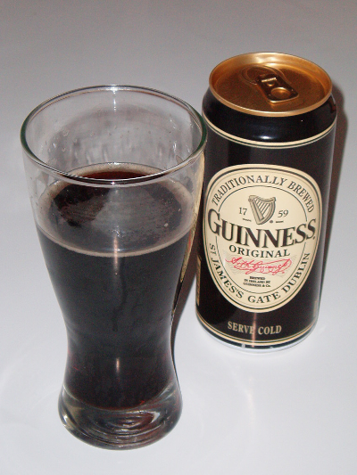
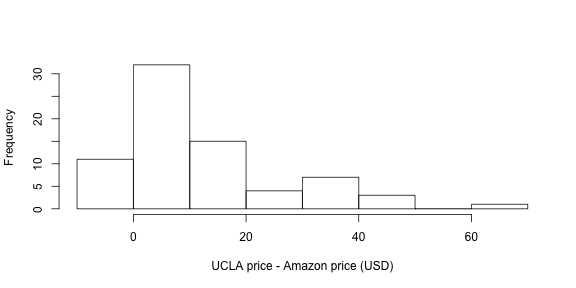
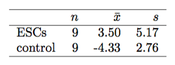
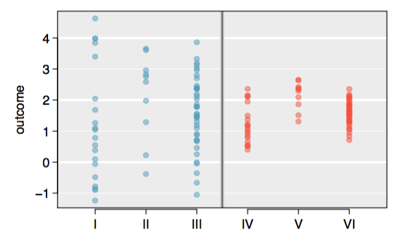

## Course Logistic

* Every Wednesday 19:00 - 21:00
* Slides: http://nikolaypavlov.github.io/da-workshops-6/
* Skype Chat: https://join.skype.com/gjN0CfAd4bhg
* Reference Book: https://www.openintro.org/stat/textbook.php
* help(dt), help(df)
* Install the following packages: openintro

---
## Topics

* t-distribution
* t-test
* Paired data
* Difference of two means
* ANOVA


---
## Student's t-distribution



---
## t-distribution and test statistics


```r
curve(dnorm, -4, 4, n = 1000, col="red", xlab="Random variable X", ylab="Density")
curve(dt(x, df=5), -4, 4, n = 1000, add=T, lwd=2)
curve(dt(x, df=15), -4, 4, n = 1000, add=T, lty=2, lwd=2)
legend("topright", c("Normal", "df=5", "df=15"), col=c("red", "black", "black"), lty=c(1,1,2))
```


$T = \frac{\text{point estimate} - \text{null value}}{SE_{\text{point estimate}}}$ - test statistics, T-score

--- 
## When to use t-distribution?

### Assumptions

* Independence of observations
* Observations come from a nearly normal distribution
* Sample size is small

--- 
## Example: Dolphins

Identify a confidence interval for the average mercury content in dolphin muscle using a sample of 19 Risso’s dolphins from the Taiji area in Japan.


$\bar{x} \pm t_{df}SE$


```r
se_dolphin <- 2.3 / sqrt(19) 
4.4 + qt(c(.025, 0.975), df=18) * se_dolphin
```

```
## [1] 3.291435 5.508565
```

---
## Exercise: One sample t-tests

The [FDA](http://www.fda.gov/food/foodborneillnesscontaminants/metals/ucm115644.htm) webpage provides some data on mercury content of fish.


Let's assume that 10 years before average mercury content of Anchovies was 0.022 ppm. We want to determine using this data whether the amount of mercury getting lower?

1. What are appropriate hypotheses for this context?
2. What is the p-value for the test, and what is your conclusion?


---
## Paired data

Are textbooks actually cheaper online?


```r
textbooks[1:5, c("ibsn", "uclaNew", "amazNew", "diff")]
```

```
##             ibsn uclaNew amazNew  diff
## 1 978-0803272620   27.67   27.95 -0.28
## 2 978-0030119194   40.59   31.14  9.45
## 3 978-0300080643   31.68   32.00 -0.32
## 4 978-0226206813   16.00   11.52  4.48
## 5 978-0892365999   18.95   14.21  4.74
```

---
## Paired data


```r
hist(textbooks$diff, xlab="UCLA price - Amazon price (USD)", main="")
```



```r
print(c(length(textbooks$diff), mean(textbooks$diff), sd(textbooks$diff)))
```

```
## [1] 73.00000 12.76164 14.25530
```

---
## Paired data

* $H_0: \mu_{diff} = 0$ - There is no difference in the average textbook price
* $H_A: \mu_{diff} \neq 0$ - There is a difference in average prices


```r
n <- length(textbooks$diff)
se_diff <- sd(textbooks$diff) / sqrt(n)
t_score_diff <- (mean(textbooks$diff) - 0) / se_diff
2 * (1 - pt(t_score_diff, df=n-1))
```

```
## [1] 6.92757e-11
```

---
## Exercise

Create a 90% confidence interval for the average price difference between books at the UCLA bookstore and books on Amazon.


---
## Difference of two means

Does treatment using embryonic stem cells (ESCs) help improve heart function following a heart attack?



The table contains summary statistics for an experiment to test ESCs in sheep that had a heart attack. Each of these sheep was randomly assigned to the ESC or control group, and the change in their hearts’ pumping capacity was measured in the study. A positive value corresponds to increased pumping capacity, which generally suggests a stronger recovery. Our goal will be to identify a 95% confidence interval for the effect of ESCs on the change in heart pumping capacity relative to the control group.

$\overline{x_{esc}} - \overline{x_{\text{control}}}$

---
## Difference of two means

### Assumptions 
1. Each sample meets the conditions for using the t-distribution
2. The samples are independent

### Standard error

$SE_{\bar{x_1} - \bar{x_2}} = \sqrt{SE_{\bar{x_1}}^2 + SE_{\bar{x_2}}^2} = \sqrt{\frac{s_1^2}{n_1} + \frac{s_2^2}{n_2}}$ 

### Degrees of freedom

$min\{n_1 - 1, n_2 - 2\}$ or use software estimate.

---
## Difference of two means

Calculate a 95% confidence interval for the effect of ESCs on the change in heart pumping capacity of sheep after they’ve suffered a heart attack.

$\overline{x_{esc}} - \overline{x_{\text{control}}} = 3.50 - (-4.33) = 7.83$

$SE = \sqrt{\frac{5.17^2}{9} + \frac{2.76^2}{9}} = 1.95$

$\text{point estimate} \pm t_8 SE \to 7.83 \pm 2.31 \times 1.95 \to (3.32, 12.34)$

We are 95% confident that embryonic stem cells improve the heart’s pumping function in sheep that have suffered a heart attack by 3.32% to 12.34%.

--- 
## Exercise: Smoke

A data set called babies_smoke represents a random sample of 150 cases of mothers and their newborns. We would like to know, is there convincing evidence that newborns from mothers who smoke have a diffeerent average birth weight than newborns from mothers who don’t smoke?


```r
babies_smoke <- babies[1:150, c("bwt", "smoke")]
```

1. Set up appropriate hypotheses.
2. Plot two histograms and check for assumptions.
3. What is the point estimate of the population difference?
4. Compute standard error.
5. Compute the p-value of the hypothesis test and evaluate the hypotheses using a significance level of $\alpha$ = 0.05.
6. After that use t.test() function to do the same.


---
## Workflow for hypothesis testing

* Write appropriate hypotheses.
* Verify conditions for using the t-distribution:
  + One-sample 
  + Paired data
  + For a difference of means
* Compute the point estimate of interest, standard error, df
* Compute T-score and p-value
* Write a conclusion in context and in plain language so anyone can understand the result.

---
## Workflow for confidence intervals

* Verify conditions for using the t-distribution as above
* Compute the point estimate of interest, standard error, df
* Calculate the confidence interval $\text{point estimate} \pm t_{df} \times SE$
* Put the conclusions in context and in plain language so anyone can understand the result.

---
## ANOVA

$H_0: \mu_1 = \mu_2 = \dotsc = \mu_k$, where $\mu_i$ the mean of the outcome for observations in category $i$

$H_A:$ at least one mean is different

### Assumptions:
* the observations are independent within and across groups
* the data within each group are nearly normal
* the variability across the groups is about equal

---
## ANOVA intuition 



ANOVA focuses on answering one question: is the variability in the sample means so large that it seems unlikely to be from chance alone?

--- 
## F test, F statistics

* $F = \frac{MSG}{MSE}$, MSG - mean square between groups, MSE - mean square error
* $MSE = \frac{1}{df_G}SSG = \frac{1}{{df_G}}\sum_{i=1}^{k}n_i(\bar{x_i} - \bar{x})^2$, where $df_G = k - 1$
* $MSE = \frac{1}{df_E}SSE = \frac{1}{df_E}(SST - SSG)$, where $df_E = n - k$
  + $SSE = \sum_{i=1}^{k}(n_i - 1)s_{i}^2$
  + $SST = \sum_{i=1}^{n}(x_i - \bar{x})^2$


```r
curve(df(x, 5, 100), 0, 5, ylab="Density", main="F-distibution, df_G = 5, df_E = 100")
```


---
## Example

Major League Baseball Player Hitting Statistics for 2010 (mlbBat10). We would like to understand whether there are real differences between the batting performance of baseball players according to their position.


```r
bat10 <- mlbBat10[mlbBat10$AB > 200, c("OBP", "position")]
bat10$position <- factor(bat10$position)
boxplot(OBP ~ position, data=bat10, ylab="On-base percentage")
```


---
## Example


```r
ftest <- aov(OBP ~ position, data=bat10)
summary(ftest)
```

```
##              Df Sum Sq  Mean Sq F value   Pr(>F)    
## position      6 0.0374 0.006233   5.275 3.35e-05 ***
## Residuals   320 0.3781 0.001182                     
## ---
## Signif. codes:  0 '***' 0.001 '**' 0.01 '*' 0.05 '.' 0.1 ' ' 1
```

---
## Exercise: Plant growth experiment


```
##   group   avg       std num
## 1  ctrl 5.032 0.5830914  10
## 2  trt1 4.661 0.7936757  10
## 3  trt2 5.526 0.4425733  10
```

1. Write the hypotheses for evaluating if the average weight level varies among the different groups.
2. Check conditions and describe any assumptions you must make to proceed with the test.
3. Compute F-statistics and p-value. Does this provide strong evidence against the $H_0$?


---
## Homework

* [Lab 6 - Inference for numerical data](http://htmlpreview.github.io/?https://github.com/andrewpbray/oiLabs-base-R/blob/master/inf_for_numerical_data/inf_for_numerical_data.html)
* Skype Chat for discussions: https://join.skype.com/gjN0CfAd4bhg
* Reading: OpenIntro Statistics Chapter 5
* Reference Book: https://www.openintro.org/stat/textbook.php
